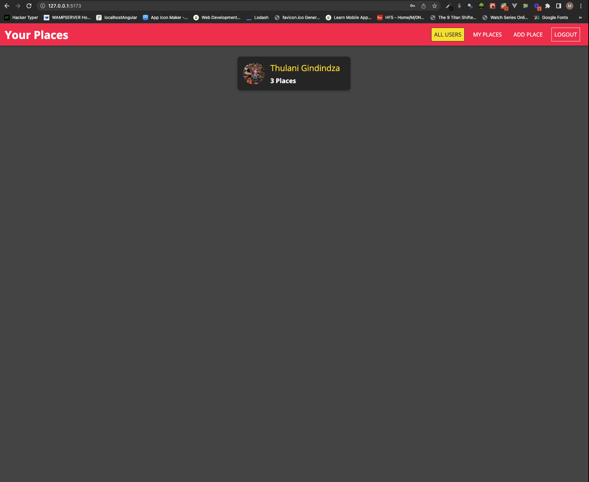

# portfolio-project

Portfolio project showcasing TypeScript, React, Swift, iOS, Mongo and Express

# Web UI

``

Port http://127.0.0.1:5173/

## What did I do differently form the course project

### For the Front End Web Application

- I am using TypeScript for the React Portion instead of JavaScript
- I used React Rouer v6 instead of v5 as on the course
- I used Vite React instead of Create-React-App
- I used React v18 instead of 17

### For the Rest API

- I am using Express JS with TypeScript instead of JavaScript

## React Practices Displayed

- Use of Stateful and Presentational components
- Keeping Components Small and Focused on One Responsibility
- Opted to destructure props
- Use the empty fragment for a more modernised react
- for the aside decided to use React Portals to have it rendered as not a child of the root div
- Use of reusable custome components eg custom Form input components etc
- Use of reusable custom hooks

## Express Practices

- Error Handling - Throwing an error for Synchrounous functions
- Error Handling - Using the Next middle ware to catch all errors in asynchronous functions

## Challenges faced

While building the types for dispatch were a little tricky. I came accross an instance where 'isVali' on file `form-hook.ts` was boolean or undefined. SOleved it using one of the options advised in `https://bobbyhadz.com/blog/typescript-type-undefined-is-not-assignable-to-type#:~:text=The%20%22Type%20'undefined'%20is,specific%20type%20before%20the%20assignment.`

# REST API

Port http://localhost:4000/

## What did I do differently form the course project

- I am using TypeScript for the Express instead of JavaScript
- I am using the `import` syntax instead of `require`

## Intersting Challenges to solve on iOS UIKit vs React

- Application wide state
- Modals - particularly when confirming delete on iOS
- Navigation
- Asynchronous tasks
- Factory Functions (iOS) / Components (React)
- Reusable Custom Hooks (React) and Custom Views (iOS UIKit)

## Sources

- https://www.udemy.com/course/react-nodejs-express-mongodb-the-mern-fullstack-guide/learn/lecture/16845448#overview
- https://dev.to/arunavamodak/react-router-v5-vs-v6-dp0
- https://react-typescript-cheatsheet.netlify.app/docs/basic/getting-started/basic_type_example
- https://bobbyhadz.com/blog/typescript-type-undefined-is-not-assignable-to-type#:~:text=The%20%22Type%20'undefined'%20is,specific%20type%20before%20the%20assignment.
- https://www.realpythonproject.com/how-to-declare-object-literals-in-typescript-the-right-way/
- https://react-typescript-cheatsheet.netlify.app/docs/basic/setup

### Yarn save dev

`yarn add --dev @types/express`
